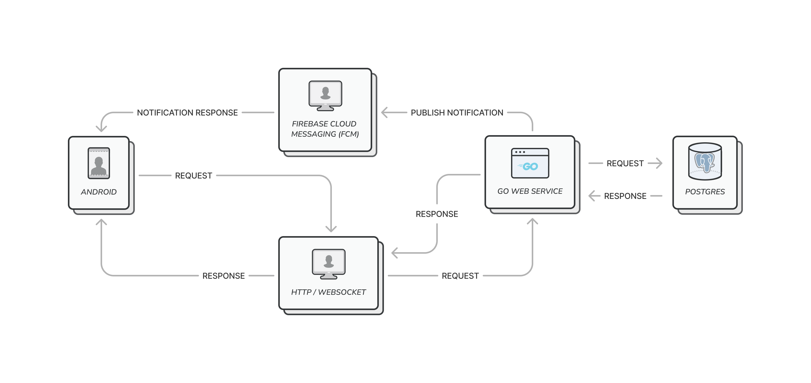

# Sosmed - Social Media App

A social media app for my experiments. I'm trying to mix twitter, instagram, facebook, and reddit.

> *What I cannot create, I do not understand — Richard Feynman.*

## Quick Links
1. [Backend](backend)
    1. Golang
    2. Postgres
    3. Rest API and WebSocket
    4. and more..
2. [Mobile Frontend](backend)
    1. Android Kotlin
    2. Jetpack Compose
    3. Model-View-ViewModel (MVVM)
    4. ML Kit
    5. and more..
3. [App Architecture](#app-architecture)
4. [Preview](#preview)

## App Architecture

## Preview

